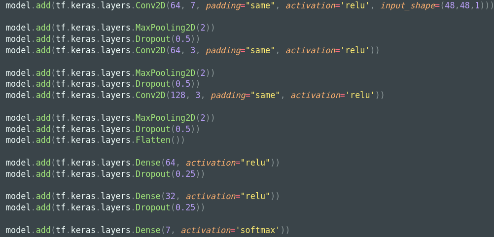

# Détecteur des émotions par les expressions faciales

## Les émotions

Le détecteur détecte 7 émotions distinctes:
- colère
- dégoût
- peur
- joie
- surprise
- tristesse
- neutre

--- 

## Description des données

Nous disposons d'images de faces humaines présentant les 7 émotions à classifier.  

Chaque photos à été découpées de sortes qu'il ne reste que les visages et leurs expressions.

Nous avons divisé le jeu de données en deux répertoires, celui pour `l'entraînement` et celui pour le `test`.

---

## Architecture

Ce CNN se structure de la façon suivante:

--- 

## Evaluation du modèle

Le score du modèle n'est pas exceptionnel, plusieurs pistes à explorer:
- augmenter le dataset
- avoir des photos plus diversifiées
- permettre un entraînement plus long
- changer de modèle de CNN

--- 

## Résultats

Voici le résultat du modèle sur quelques émotions:

- Colère

- Joie

- Surprise

Il est à noter que le modèle se trompe régulièrement sur des émotions, en particulier pour le `neutre`, et confonds souvent `peur` et `surprise`.
